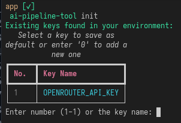
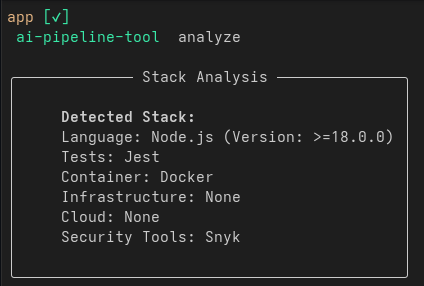
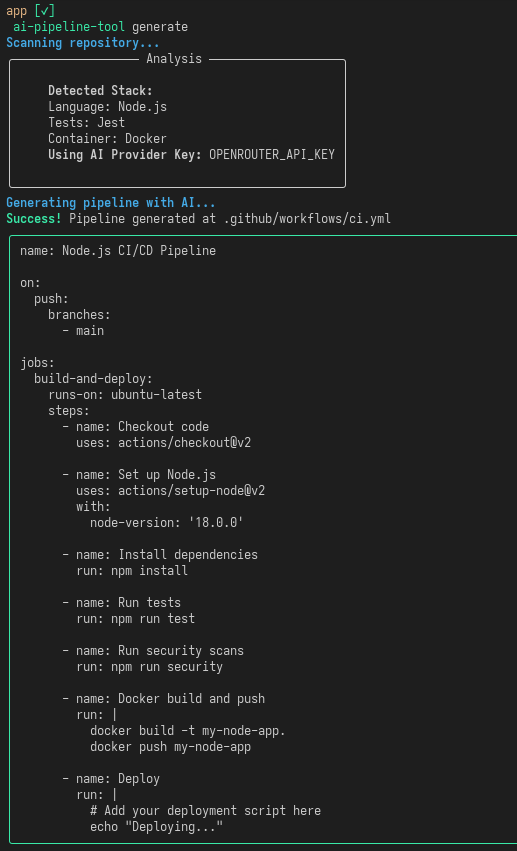

# AI Pipeline Tool

AI Pipeline é uma ferramenta de linha de comando (CLI) desenvolvida em Python para automação de processos de CI/CD. A ferramenta analisa o código-fonte de um repositório, identifica a pilha tecnológica (stack) e utiliza interfaces de inteligência artificial para gerar arquivos de configuração.

## Funcionalidades

- **Escaneamento de Repositório**: Localização de arquivos de configuração padrão (package.json, requirements.txt, Dockerfile, terraform, etc).
- **Detecção de Stack**: Identificação de linguagem de programação, versões, frameworks de teste e ferramentas de segurança.
- **Gerador de Pipeline**: Geração automatizada de workflows do GitHub Actions (.github/workflows/ci.yml) baseada nos dados detectados.
- **Multi-Provedor**: Suporte a diversos provedores de IA através de detecção automática de chaves de ambiente.
- **Seleção Interativa**: Interface numerada para seleção de chaves quando múltiplas opções são detectadas no ambiente.

## Arquitetura do Processo

1. **Scan**: O sistema varre o diretório atual em busca de marcadores tecnológicos.
2. **Analysis**: O motor de detecção extrai metadados como versões de motores (ex: Node v18) e scripts de execução.
3. **Prompt Engineering**: Os metadados são estruturados em um prompt técnico enviado ao provedor de IA selecionado.
4. **Generation**: O YAML retornado é validado e persistido no diretório .github/workflows/.

## Instalação

Pode ser feita diretamente via pip:

```bash
pip install ai-pipeline-tool
```
```sh
ai-pipeline-tool version
```

## Configuração

A ferramenta busca automaticamente e para configurar uma chave manualmente ou definir uma padrão para o diretório atual:

```bash
ai-pipeline-tool init
```


### Uso com Ollama (Local)

Para utilizar modelos locais via Ollama:

1. Garanta que o Ollama está rodando (`ollama serve`).
2. Defina o modelo desejado no ambiente:
   ```bash
   export OLLAMA_MODEL="llama3.1:8b"
   ```
3. Execute `ai-pipeline-tool init` e selecione a opção `OLLAMA_MODEL`.
4. A ferramenta enviará as requisições para `http://localhost:11434/v1`.

### Analisar Projeto
Para verificar o que a ferramenta detecta sem gerar arquivos:

```bash
ai-pipeline-tool analyze
```


### Gerar Workflow de CI/CD
Para executar o fluxo completo de detecção e geração do arquivo de pipeline:

```bash
ai-pipeline-tool generate
```



## Requisitos Técnicos

- Python 3.11 ou superior
- Bibliotecas: typer, pydantic, pyyaml, rich, requests, python-dotenv
- Acesso a uma API de IA compatível.

## Logs

Todas as operações,são registrados no arquivo `ai-pipeline-tool.log` na raiz.
